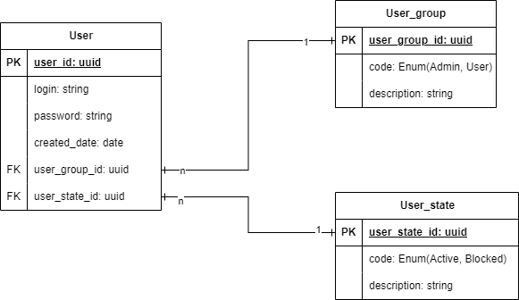

<p>
    <h1 align="center">User-Service</h1>
</p>

<p align="center">
  
  
  
  
  
  
 
</p>

# Интро

Данный проект был реализован с помощью следующих технологий:
- C# и фреймворк ASP .NET 7.0
- Entity Framework для ORM
- Для хранения данных использовался PostgreSQL
- Для контейнеризации использовался Docker
- Раскат CI / CD на Github Acions

**Cхема базы данных:**


В целевом решении надо использовать переменные окружения для Github Actions и использовать Vault для хранения всех паролей и других чувствительных данных, но я решил упростить все это, но по-хорошему нельзя постить вот так данные в репозиторий.

# Задача

Необходимо реализовать API приложение на ASP.NET Core (5 или более поздняя версия).

## Требования бизнес-логики и ограничения:

- [X] Формат запроса/ответа должен быть JSON.
- [X] Методы API должны быть асинхронными.
- [X] В качестве СУБД необходимо использовать PostgreSQL.
- [X] В качестве ORM необходимо использовать Entity Framework.
- [X] В качетве модели данных должны использоваться следующие сущности:
    - user (id, login, crated_date, user_group_id, user_state_id)
    - user_group(id, code, description). Возможные значения для code: Admin, User
    - user_state(id, code, description). Возможные значения для code: Active, Blocked.
- [X] Приложение должно позволять добавлять/удалять/получать пользователей. Получить можно как одного, так и всех пользователей (добавление/удаление только по одному). При получении пользователей должна возвращаться полная информация о них (с user_group и user_state).
- [X] Система должна не позволять иметь более одного пользователя с user_group.code = "Admin".
- [X] После успешной регистрации нового пользователя, ему должен быть выставлен статус "Active". Добавление нового пользователя должно занимать 5 сек. За это время при попытке добавления пользователя с таким же login должна возвращаться ошибка.
- [X] Удаление пользователя должно осуществляться не путем физического удаления из таблицы, а путем выставления статуса "Blocked" у пользователя.
- Допускается добавлять вспомогательные данные в существующие таблицы.

## Опционально:
- [X] В качестве способа авторизации следует использовать Basic-авторизацию.
- [X] Реализовать пагинацию для получения нескольких пользователей.
- [X] Написать unit-тесты с помощью xUnit.

# Локальный запуск
- ```git clone https://github.com/ExtraHot/user-app.git```

- ```cd user-app```

- ```docker-compose build```

- ```docker-compose up```


